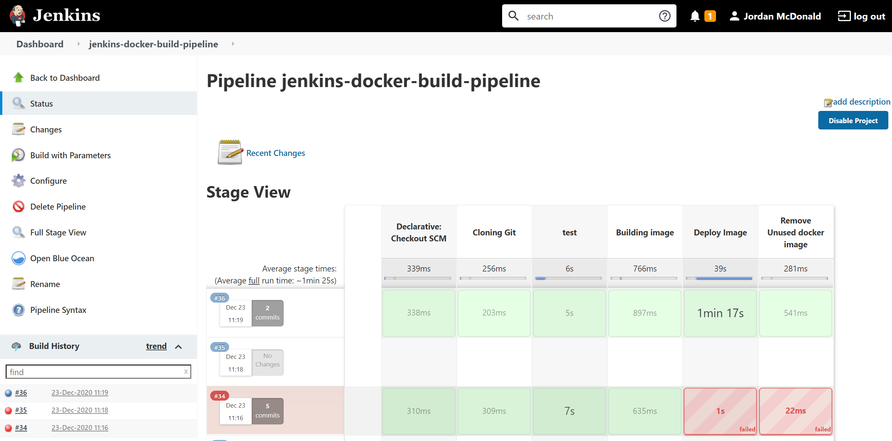
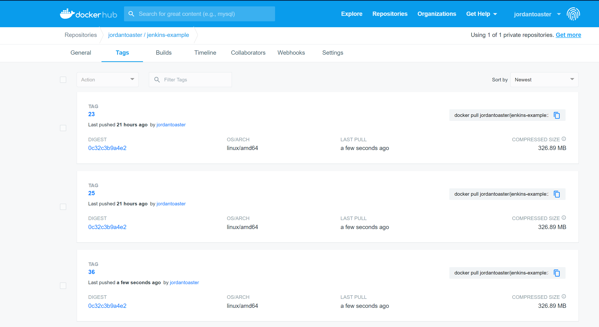

## Overview

This sample repository is to outline a basic setup for a remote Jenkins server on AWS alongside a basic CI pipeline.

## Jenkins on AWS Setup

1. In your AWS console create a micro EC2 Linux instance - Add a security group for TCP access to port 8080

2. SSH into your EC2 Machine.

3. Update the stock packages - ``sudo yum update –y`` - install Git ``sudo yum install git -y``

4. Ensure you have the 1.8 version of Java - ``sudo yum install java-1.8.0`` + ``sudo yum remove java-1.7.0-openjdk``

5. Get the Jenkins Repository reference - ``sudo wget -O /etc/yum.repos.d/jenkins.repo http://pkg.jenkins-ci.org/redhat/jenkins.repo``

6. Get the key for the Jenkins install - ``sudo rpm --import https://pkg.jenkins.io/redhat/jenkins.io.key``

7. Install Jenkins - ``sudo yum install jenkins -y``

8. Start Jenkins - ``sudo service jenkins start``

9. Navigate to the IP of your machine, aiming for port 8080.

10. Run ``sudo cat /var/lib/jenkins/secrets/initialAdminPassword`` to get your initial Jenkins admin password inside your SSH terminal, enter the result into the 'unlock' screen of Jenkins.

11. Install the recommended set of plugins for Jenkins - also install the docker plugin

12. Install Docker - ``sudo yum install docker`` and start it ``sudo service docker start``

13. Give the jenkins user access to docker ``sudo chmod 777 /var/run/docker.sock`` - log out and into terminal again + restart jenkins.

Now you can create users and pipelines as required.

## Pipeline Overview

The pipeline is setup so that the infrustructure and contanier setup is defined in code via a ``Dockerfile`` and ``Jenkinsfile``.

The pipeline is configured initially on the Ec2 micro box via the Jenkins user interface, in which parameters and source code references are defined, in this case to Github.

The pipeline performs a few basic steps:

1. It is triggered manually by the user un the Jenkins UI.
2. The repository is cloned from Master.
3. The unit tests are run within a docker agent, which reflects the development environment and deployed artifact.
4. The Docker image is created.
5. The docker image is pushed to docker hub.
6. The image created locally in Jenkins is deleted.

## Improvements

1. Bundle Jenkins setup into a DockerFile on EC2, including all the currently manual ``yum`` installation steps.

2. Convert basic app to be a simple flask app - modify pipeline to deploy image onto a EC2 server to simulate a deployment.

3. Expand on the above to have dev and production environment selection built into the pipeline.

4. Production may not need the tests to be copied into the image.

5. Consider a multi branch variant of this pipeline.

6. Consider non manual approaches, polling in a more CD fashion.

7. Consider how primary and secondary nodes can be used for autoscaling.